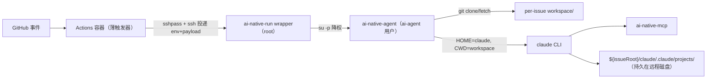
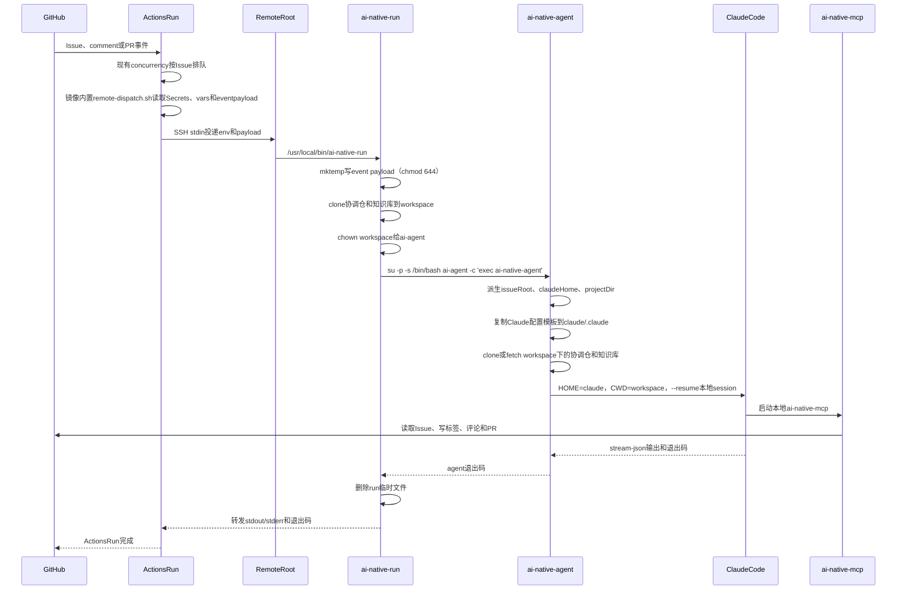
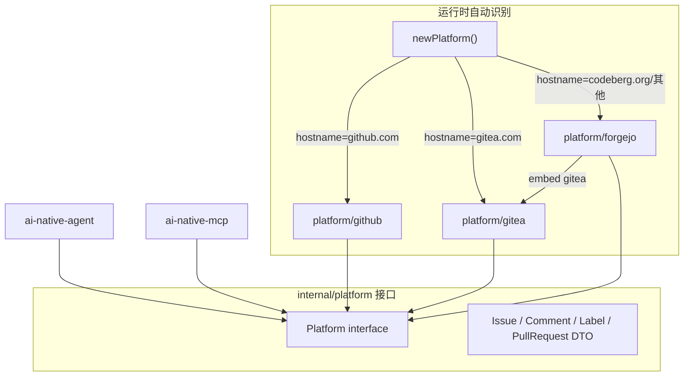
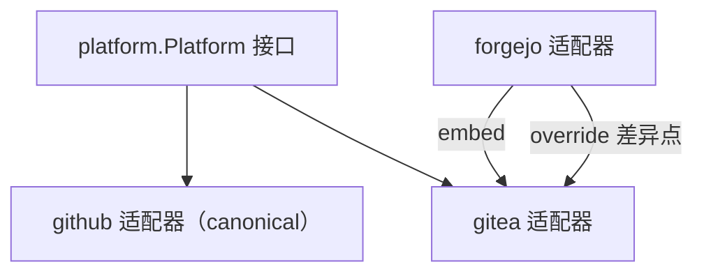

## 总体架构



## 每次 Run 时序



## 命名映射总表

| 维度 | 原（Forgejo） | 新（GitHub 标准，中立命名） |
|------|--------------|---------------------------|
| Go module path | `codeberg.org/niklaus/ai_native_dev/forgejo-act` | `github.com/clawtroop/ai_native_dev/ai-native-act` |
| Go 目录 | `forgejo-act/` | `ai-native-act/` |
| Agent 目录 | `agents/forgejo-ai/` | `agents/ai-native/` |
| Agent 二进制 | `ai-forgejo-agent` | `ai-native-agent` |
| MCP 二进制 | `forgejo-mcp-server` | `ai-native-mcp` |
| MCP config key | `"forgejo"` | `"ai-native"` |
| API client 包 | `internal/forgejo/` | `internal/platform/`（接口）+ `github/`、`gitea/`、`forgejo/` 三个适配器 |
| Skill name 前缀 | `forgejo-align` 等 | `ai-native-align` 等 |
| 容器镜像 | `.../forgejo/ai-forgejo-agent:1.38` | `ghcr.io/clawtroop/ai-native-agent:dev`（GHCR） |
| Workflow 目录 | `.forgejo/workflows/` | `.github/workflows/` |
| Issue 模板 | `.forgejo/issue_template/` | `.github/ISSUE_TEMPLATE/` |

## Env 变量映射

| 原（Forgejo） | 新（GitHub 原生 / 中立） | 说明 |
|--------------|------------------------|------|
| `FORGEJO_URL` | `GITHUB_SERVER_URL` | GitHub Actions 原生注入，无需 workflow 手动设置 |
| `FORGEJO_REPO` | `GITHUB_REPOSITORY` | GitHub Actions 原生注入 |
| `FORGEJO_TOKEN` | `GITHUB_TOKEN` | GitHub Actions 原生注入，需 `permissions:` 块 |
| `AI_NATIVE_FORGEJO_TOKEN` | `AI_NATIVE_TOKEN` | PAT，用于跨仓 clone/PR |
| `FORGEJO_MCP_COMMAND` | `AI_NATIVE_MCP_COMMAND` | MCP 二进制路径覆盖 |
| `PROJECT_ID` / `AI_NATIVE_PROJECT_ID` | （删除） | 移除 Project 看板 |
| `AI_NATIVE_TOS_*` | （删除） | 移除 TOS session 备份 |

`GITHUB_EVENT_NAME`、`GITHUB_EVENT_PATH`、`GITHUB_RUN_NUMBER` 已被 agent 使用，保持不变。

## 平台抽象架构

agent 与 MCP server 不再直接依赖具体平台 API client，而是依赖 `internal/platform.Platform` 接口。运行时根据 `GITHUB_SERVER_URL` hostname 自动识别平台并选择适配器，无需显式配置。



### Platform 接口（实际实现）

接口方法不含 `context.Context` 和 `owner/repo` 参数——repo 在构造时绑定，方法只接收 issue number 等：

```go
package platform

type Platform interface {
    Name() string
    CurrentUser() (*User, error)
    GetIssue(number int) (*Issue, error)
    CloseIssue(number int) (*Issue, error)
    ListIssueComments(number int) ([]Comment, error)
    AddComment(number int, body string) (*Comment, error)
    AddLabel(number int, label string) error
    RemoveLabel(number int, label string) error
    ListLabels() ([]Label, error)
    CreateLabel(name, color, desc string) (*Label, error)
    ListOpenPullRequests(head, base string) ([]PullRequest, error)
    CreatePullRequest(head, base, title, body string) (*PullRequest, error)
    UpdatePullRequest(number int, title, body string) (*PullRequest, error)
    UpsertPullRequest(head, base, title, body string) (*PullRequest, bool, error)
    RepositoryURL(repository string) (string, error)
    IsNotFound(err error) bool
}
```

DTO 包括 `User`、`Issue`、`Comment`、`Label`、`PullRequest`、`Branch`，字段以 GitHub REST v3 wire 格式为 canonical（如 `html_url`、`login`）。

### 平台选择规则（hostname 自动识别）

无需任何显式配置，运行时按 `GITHUB_SERVER_URL` 的 hostname 自动识别平台：

| hostname | 选择的适配器 |
|----------|-------------|
| `github.com` / `*.ghe.com` | `platform/github` |
| `*.gitea.com` / `*.gitea.io` | `platform/gitea` |
| `codeberg.org` / `*.forgejo.com` / `*.forgejo.org` | `platform/forgejo` |
| 其他自建实例 | `platform/gitea`（默认，Gitea/Forgejo API 兼容，gitea 是超集） |

不支持显式指定平台；新增平台支持只需在 factory 的 hostname 映射表里加一条。

### 适配器继承关系

Forgejo 是 Gitea 的 fork，两者 API 几乎一致（均用 `/api/v1/`、`token` auth）。为避免重复代码，`forgejo` 适配器薄包装 `gitea` 适配器，仅在 Forgejo 特有差异处 override：



### 设计原则：GitHub 规范为 canonical

接口方法签名按 GitHub REST v3 规范设计。各适配器只在偏离 GitHub 规范处做适配：

| 差异点 | GitHub（canonical） | Gitea / Forgejo 偏离 |
|--------|-------------------|---------------------|
| Base URL | `/repos/{owner}/{repo}/...` | `/api/v1/repos/{owner}/{repo}/...` |
| Auth header | `Authorization: Bearer <token>` | `Authorization: token <token>` |
| Labels | name-based `PUT /issues/{n}/labels` | Gitea: ID-based；Forgejo: 兼容 name |
| PR head | `owner:branch`（fork） | branch name only |
| Issue attachments | 无原生附件 | Gitea/Forgejo 有 `assets` + `browser_download_url`（接口层不暴露） |
| Projects | Projects v2（GraphQL） | Gitea/Forgejo repo-scoped board（本计划移除，不实现） |
