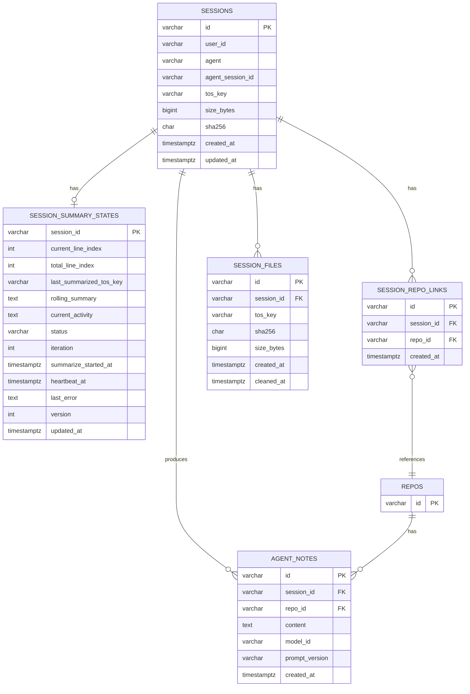
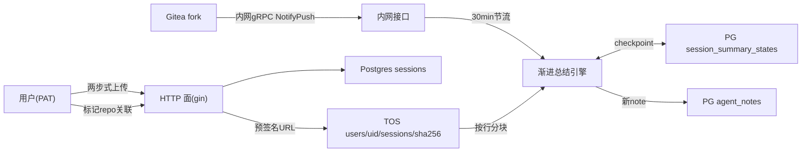
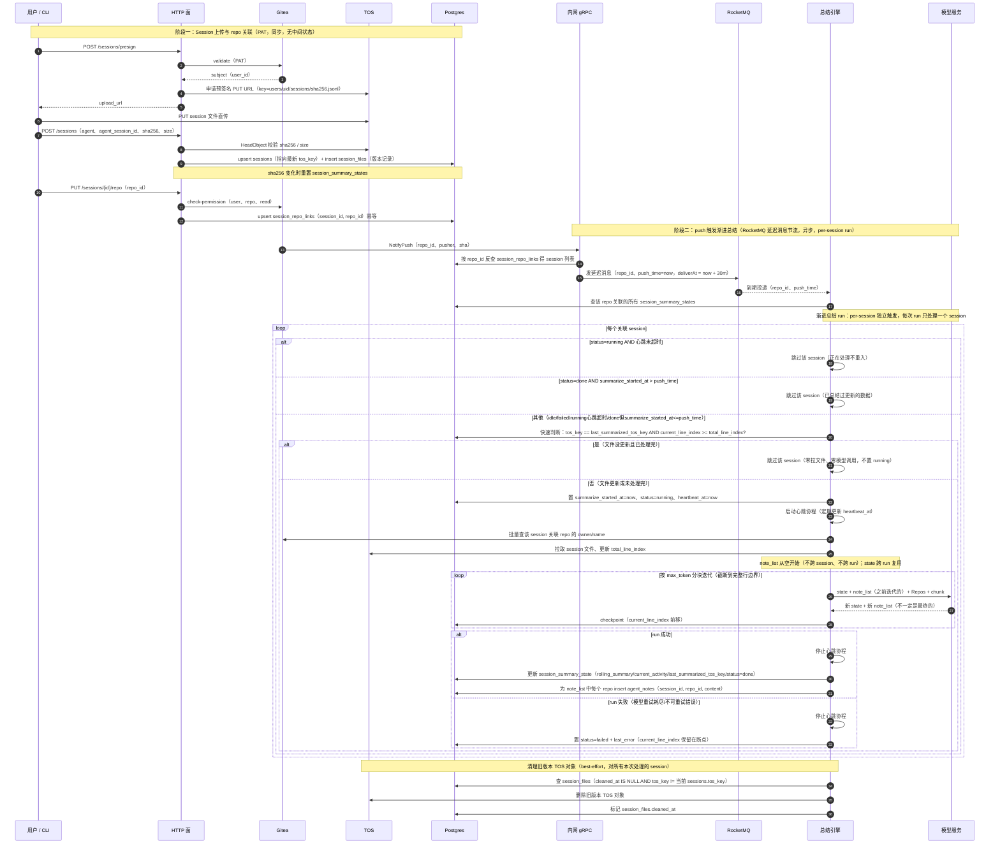

# Agent Note 服务设计

> 原始来源：[clawtroop/wehub_docs](https://github.com/clawtroop/wehub_docs/blob/main/tech/agent-note/AgentNote_%E6%9C%8D%E5%8A%A1%E8%AE%BE%E8%AE%A1.md)
> 文档归属人：Jayden
> 更新时间：2026-08-05
> 状态：进行中
> 定位：Agent Note 服务端技术真源（PAT 上传 session 文件 + repo 关联 + Session 渐进总结）。架构镜像 wehub_cloud，单进程双端口。长期目标（hook 采集、意图分组、冻结输入包四模块）见 [`AgentNote_技术设计.md`](AgentNote_技术设计.md)，调研见 [`../../prd/research/AgentNote_意图分组与云端生成方案调研.md`](../../prd/research/AgentNote_意图分组与云端生成方案调研.md)，整体架构见 [`../整体架构.md`](../整体架构.md)。
> 本文为当前 MVP 的服务端方案，与旧技术设计互链并用一小节明确取舍关系（见 §1.2）。

---

## 阅读导航

- [1. 定位与边界](#1-定位与边界)
- [2. 仓库与代码组织](#2-仓库与代码组织)
- [3. 对外 HTTP 接口](#3-对外-http-接口)
- [4. 内网接口](#4-内网接口)
- [5. 数据模型](#5-数据模型)
- [6. 数据流总览](#6-数据流总览)
- [7. 端到端时序图](#7-端到端时序图)
- [8. Session 渐进总结引擎](#8-session-渐进总结引擎)
- [9. 安全与鉴权](#9-安全与鉴权)
- [10. 错误码、配置项清单、部署](#10-错误码配置项清单部署)
- [11. 待裁决](#11-待裁决)
- [12. 与既有文档的关系](#12-与既有文档的关系)

---

## 1. 定位与边界

### 1.1 三大能力

1. **PAT 上传 session 文件**：用户使用 PAT 通过公网 HTTP 接口上传自己的 session 文件，元信息存入 Postgres，原始文件保存到 TOS（每用户一个目录，内容寻址命名）。
2. **repo 关联**：提供接口标记 session 与 Gitea 仓库之间的关系（多对多）。
3. **Session 渐进总结**：Gitea 代码 push 触发（30 分钟节流），从头遍历 session 数据，维护 session summary state，逐步迭代产出 AgentNote。

### 1.2 与旧技术设计的取舍

| 维度 | 旧技术设计（长期目标） | 本服务设计（当前 MVP） |
|------|------------------------|------------------------|
| 采集方式 | hook + session-sync 自动采集 | PAT 手动上传（hook 链路后续复用同一上传契约接入） |
| 生成方式 | 全量快照生成（冻结输入包 → facts + 叙事） | 增量滚动总结（分块迭代，state 跨 run 复用） |
| Note 结构 | 结构化（task_description/change_summary/...） | 字符串（刻意不定义内部结构） |
| 触发时机 | Session 快照变化 + commit 观察 | Gitea push 触发（RocketMQ 延迟消息节流） |
| 关联模型 | Membership（session_snapshot/commit 成员关系） | session_repo_links（多对多） |

### 1.3 与 CLI hook 链路的关系

本次只设计服务端。客户端如何产生 session 文件（手动上传 / hook session-sync）不在本期，hook 链路沿用旧设计后续复用同一上传契约接入。

---

## 2. 仓库与代码组织

新独立仓库 `wehub_agent_note`，镜像 wehub_cloud 结构：

```
wehub_agent_note/
  cmd/wehub-agent-note/          # run() 返回 error 的 wehub_wallet 风格
  pkg/auth/                       # Plugin 接口
  plugins/auth/gitea/             # Gitea internal 实现
  internal/
    server/                       # 含 authextract
    config/
    session/
    store/
    tos/
    summary/
    lock/                         # 复用 wehub_cloud RedisLocker 分布式锁模式
    ids/
    logrus/
    tracing/
    apperr/
  migrations/                     # 参考性 SQL（agentnote_001_init.sql）
  config/config.{dev,staging,online}.yaml
  k8s/
  Dockerfile                      # 多阶段、goproxy.cn、CONFIG_ENV、/healthz 探针
```

---

## 3. 对外 HTTP 接口

PAT 鉴权，经火山网关对外。**不维护 pending_upload 中间状态，先传 TOS 再写 DB**。

### 3.1 Session 上传（两步式）

**`POST /api/agentnote/v1/sessions/presign`**

无状态接口，仅校验 PAT 后返回预签名 PUT URL。TOS key 约定 `users/<gitea_user_id>/sessions/<sha256>.jsonl`（内容寻址命名天然去重）。不落库。

**`PUT {upload_url}`**

客户端直传 TOS。

**`POST /api/agentnote/v1/sessions`**

body：`agent`、`agent_session_id`、`sha256`、`size_bytes`

服务端 `HeadObject` 校验 TOS 中对象存在且 sha256/size 匹配，通过后：

- upsert `sessions` 行（幂等键 `(user_id, agent, agent_session_id)`：DB 行始终指向最新 sha256 的 TOS 对象）
- sha256 与旧值不同时**重置 `session_summary_states`**——`current_line_index=0`、`rolling_summary=''`、`current_activity=''`、`status=idle`——因为新文件需从头总结
- 往 `session_files` 插入新版本记录（记录 tos_key/sha256/size_bytes）
- 不做覆盖判断，旧 TOS 对象保留，由总结引擎完成后按 `session_files` 表清理
- 无 pending_upload 中间态

### 3.2 Repo 关联

**`PUT /api/agentnote/v1/sessions/{id}/repo`**

body：`repo_id`

点查 Gitea check-permission（user、repo、read）后向 `session_repo_links` 插入 `(session_id, repo_id)` 唯一对；幂等：已存在则成功返回。

### 3.3 查询接口

**`GET /api/agentnote/v1/sessions/{id}`** — 查询 session 元信息（含关联 repo 列表）。

**`GET /api/agentnote/v1/repos/{repo_id}/notes`** — 按 repo 查 agent note 列表（时间倒序）。

**`GET /api/agentnote/v1/repos/{repo_id}/notes/latest`** — 最近一条。

> 两接口均需点查 Gitea check-permission（user、repo、read）鉴权，无权限 404 防探测。

### 3.4 删除接口

**本期不提供删除接口**（DELETE session、DELETE repo 关联）——后续再补；session 删除需求暂由 DBA 手动处理（级联清理 session_files/session_repo_links/session_summary_states/agent_notes）。

---

## 4. 内网接口

**`AgentNoteService.NotifyPush`**（内网 gRPC，Gitea fork push 扇出，镜像 `CloudServer.NotifyPush` 形态）

内网端口网络层信任、无应用层鉴权，与 wehub_cloud/wehub_wallet 一致。

> 备选：Gitea system webhook → 内网 HTTP，列为待裁决（§9）。

---

## 5. 数据模型

Postgres 五表 + TOS 布局。

### 5.1 ER 图



> `REPOS` 是 Gitea 侧的仓库表，本服务不持有其数据，仅在 ER 图中标示外键语义；`session_repo_links.repo_id` 与 `agent_notes.repo_id` 均为逻辑外键，不加数据库外键约束（跨服务）。`sessions.tos_key`/`sha256`/`size_bytes` 是当前版本的冗余（便于查询不用 join），完整版本历史在 `session_files` 表。

### 5.2 DDL

> 参考性 SQL；真源为 GORM AutoMigrate 的 model 结构体。

```sql
-- sessions：用户上传的 session 文件元信息。无 status 列——行只在 TOS 校验通过后写入，恒为 ready。
CREATE TABLE sessions (
    id               VARCHAR(32)   PRIMARY KEY,                       -- sess_xxx
    user_id          VARCHAR(64)  NOT NULL,                           -- Gitea user id 十进制字符串
    agent            VARCHAR(32)  NOT NULL,                           -- claude-code | cursor | ...
    agent_session_id VARCHAR(128) NOT NULL,                           -- agent 提供的稳定 Session ID
    tos_key          VARCHAR(512) NOT NULL,                           -- users/<uid>/sessions/<sha256>.jsonl
    size_bytes       BIGINT       NOT NULL,
    sha256           CHAR(64)     NOT NULL,                           -- hex，与 TOS 对象内容一致
    created_at       TIMESTAMPTZ  NOT NULL,
    updated_at       TIMESTAMPTZ  NOT NULL
);

CREATE UNIQUE INDEX uq_sessions_user_agent_sid ON sessions (user_id, agent, agent_session_id);

-- session_files：session 文件版本历史。每次上传插入新记录；清理后标记 cleaned_at。
CREATE TABLE session_files (
    id         VARCHAR(32)  PRIMARY KEY,                              -- sf_xxx
    session_id VARCHAR(32) NOT NULL REFERENCES sessions(id) ON DELETE CASCADE,
    tos_key    VARCHAR(512) NOT NULL,
    sha256     CHAR(64)   NOT NULL,
    size_bytes BIGINT      NOT NULL,
    created_at TIMESTAMPTZ NOT NULL,
    cleaned_at TIMESTAMPTZ                                           -- nullable，标记已清理
);

CREATE INDEX idx_session_files_session ON session_files (session_id, created_at DESC);
CREATE INDEX idx_session_files_pending ON session_files (session_id) WHERE cleaned_at IS NULL;

-- session_repo_links：session 与 repo 的多对多关联。
-- repo_id 是逻辑外键（Gitea 侧 repo id 十进制字符串），不加数据库外键约束。
CREATE TABLE session_repo_links (
    id         VARCHAR(32)  PRIMARY KEY,                              -- srl_xxx
    session_id VARCHAR(32) NOT NULL REFERENCES sessions(id) ON DELETE CASCADE,
    repo_id    VARCHAR(64) NOT NULL,
    created_at TIMESTAMPTZ NOT NULL
);

CREATE UNIQUE INDEX uq_srl_session_repo ON session_repo_links (session_id, repo_id);
CREATE INDEX idx_srl_repo_id ON session_repo_links (repo_id);

-- session_summary_states：单个 session 的渐进总结进度，每 session 至多一行。按 session 维度跨 run 复用。
-- summarize_started_at 记录上次总结开始执行的时间点，用于 per-session 节流去重守门（与消息 push_time 比较）。
-- heartbeat_at 是 running 期间的心跳时间戳，配合 stale_timeout 判定 running 是否已死（崩溃/卡死）。
CREATE TABLE session_summary_states (
    session_id         VARCHAR(32)  PRIMARY KEY REFERENCES sessions(id) ON DELETE CASCADE,
    current_line_index INT          NOT NULL DEFAULT 0,              -- 下次迭代的起始行
    total_line_index   INT          NOT NULL DEFAULT 0,              -- 上次拉文件后的总行数
    last_summarized_tos_key VARCHAR(512) NOT NULL DEFAULT '',        -- 上次总结时处理的文件 tos_key（含 sha256）
    rolling_summary    TEXT         NOT NULL DEFAULT '',             -- 前面内容的总结（跨 run 累积）
    current_activity   TEXT         NOT NULL DEFAULT '',            -- 当前正在做的事情（跨 run 累积）
    status             VARCHAR(16)  NOT NULL DEFAULT 'idle',         -- idle | running | done | failed
    iteration          INT          NOT NULL DEFAULT 0,
    summarize_started_at TIMESTAMPTZ,                                 -- 上次总结开始执行时间，节流守门依据
    heartbeat_at       TIMESTAMPTZ,                                   -- running 期间心跳，判活依据
    last_error         TEXT         NOT NULL DEFAULT '',
    version            INT          NOT NULL DEFAULT 0,            -- 乐观锁
    updated_at         TIMESTAMPTZ  NOT NULL
);

-- agent_notes：(session_id, repo_id) 维度的 AgentNote，每次 run 为每个关联 repo 产出一条。
-- session_id 是物理外键（跟随 sessions 删除）；repo_id 是逻辑外键（Gitea 侧 repo id），不加数据库外键约束。
CREATE TABLE agent_notes (
    id            VARCHAR(32)  PRIMARY KEY,                           -- an_xxx
    session_id    VARCHAR(32)  NOT NULL REFERENCES sessions(id) ON DELETE CASCADE,
    repo_id       VARCHAR(64) NOT NULL,
    content       TEXT         NOT NULL,                             -- 字符串，刻意不定义内部结构
    model_id      VARCHAR(64) NOT NULL DEFAULT '',
    prompt_version VARCHAR(32) NOT NULL DEFAULT '',
    created_at    TIMESTAMPTZ NOT NULL
);

CREATE INDEX idx_agent_notes_repo_created ON agent_notes (repo_id, created_at DESC);
```

### 5.3 TOS 布局

每用户一目录 `users/<gitea_user_id>/sessions/<sha256>.jsonl`（内容寻址文件名天然支持去重；版本历史由 `session_files` 表管理，TOS 不按 session 分目录）。

### 5.4 字段语义要点

- **`sessions`** 无 `status` 列、无 `repo_id` 列、无 `schema_version` 列：行只在 `POST /sessions` 通过 TOS `HeadObject` 校验后写入，恒为 ready；无 pending_upload 中间态。repo 关联走 `session_repo_links` 表（多对多）。多次上传同一 session（同 `user_id+agent+agent_session_id`）时 DB 行 upsert 指向最新 sha256 的 TOS 对象，不做覆盖判断；sha256 变化时重置 `session_summary_states`，旧 TOS 对象由总结引擎完成后按 `session_files` 表清理（best-effort）。

- **`session_files`**：版本历史表。每次上传插入新记录（tos_key/sha256/size_bytes/created_at）；`cleaned_at` 标记已清理。清理时查 `cleaned_at IS NULL AND tos_key != 当前 sessions.tos_key` 的旧版本，删 TOS 对象后标记 `cleaned_at`。`idx_session_files_pending` 部分索引加速待清理查询。`sessions.tos_key`/`sha256`/`size_bytes` 是当前版本冗余，避免查当前版本时 join。

- **`session_repo_links`**：唯一键 `(session_id, repo_id)` 保证幂等；`idx_srl_repo_id` 索引供 NotifyPush 按 repo 反查关联 session 列表。`repo_id` 是逻辑外键（Gitea 侧 repo id），不加数据库外键约束（跨服务，Gitea repo 删除时本表不会级联——后续可加对账任务清理孤儿行）。

- **`session_summary_states`**：按 session 维度记录渐进总结进度，跨 run 复用。`current_line_index` 是续跑游标；`total_line_index` 是上次拉文件后的总行数；`last_summarized_tos_key` 记录上次总结时处理的文件 tos_key（含 sha256）。**快速判断是否需要处理**（不拉文件，在置 running 之前）：`sessions.tos_key == last_summarized_tos_key AND current_line_index >= total_line_index` → 跳过（不置 running）；否则拉文件处理。`rolling_summary`+`current_activity` 是跨 run 累积的 state；`summarize_started_at` 是上次总结开始执行的时间点，配合 `status` 与 `heartbeat_at` 做 per-session 四条件守门（running 且心跳未超时跳过防重入；running 且心跳超时视为 stale 重新触发；done 且 summarize_started_at > push_time 跳过防重复；failed/idle 或 done 但 summarize_started_at <= push_time 触发 run）。`heartbeat_at` 是 running 期间的心跳时间戳，run 开始时启动独立协程定期更新（间隔 `summary.heartbeat_interval` 默认 30s），run 结束时停止，配合 `summary.stale_timeout`（默认 10m）判定 running 是否已死。**不做启动时回收、不做 checkpoint 续跑恢复**——恢复靠下次事件到达时的心跳超时判断，自然从 current_line_index 继续。失败的 run（status=failed）下次 push 会重试。

- **`agent_notes`**：(session_id, repo_id) 维度，每次 run 为每个关联 repo 产出一条。一次 run 处理一个 session，迭代完成后为该 session 关联的所有 repo 各 insert 一条（note_list 收敛后逐个 insert）；一个 push 可能触发多个 session 的 run，每个 run 又产出多条 note。`idx_agent_notes_repo_created` 索引供按时间倒序查 repo 的 note 列表。无 `revision` 列（append 而非覆盖）。

- **删除级联**：`session_repo_links`/`session_summary_states`/`agent_notes` 均以 `ON DELETE CASCADE` 跟随 `sessions` 删除（`agent_notes.session_id` 物理外键）。`repo_id` 是逻辑外键（跨服务），Gitea repo 删除时本表不会级联——后续可加对账任务清理孤儿行。

---

## 6. 数据流总览



---

## 7. 端到端时序图



---

## 8. Session 渐进总结引擎

### 8.1 配置

```yaml
summary:
  model:
    endpoint: ""
    api_key: ""
    model: ""
    max_token: 0
    timeout: 60s
    max_retries: 2
  throttle: 30m
  stale_timeout: 10m        # running 心跳超时阈值
  heartbeat_interval: 30s   # 心跳更新间隔
  lock_ttl: 5m              # per-session 分布式锁 TTL
  rocketmq:
    endpoint: ""
    group_name: ""
    topic: ""
    access_key: ""
    secret_key: ""

redis:
  addr: ""
  password: ""
  db: 0
```

- **节流用 RocketMQ 5.x 延迟消息**（复用 wehub_cloud `internal/billing/queue` 的 `DelayedQueue` 接口形态，`SetDelayTimestamp` 支持任意延时时间戳）
- **per-session 互斥用 Redis 分布式锁**（复用 wehub_cloud `internal/lock/RedisLocker` 模式）

### 8.2 分块

从 `current_line_index` 起按 `max_token` 推导 chunk token 预算（扣除 prompt 与输出预留），向前累计行估算 token，截断到最后一个完整行边界。token 估算默认 chars/4 启发式（精确 tokenizer 待裁决）。session 文件按行处理（JSONL 为预期格式，任意行分隔文本均可）。

### 8.3 渐进总结 run（per-session，无聚合步骤）

一次 run 只处理一个 session。push repo X 后，对 repo X 关联的每个 session 独立触发一次 run，每次 run 为该 session 关联的**所有 repo** 各产出一条 agent_notes（不只 repo X）。note_list 不跨 session、不跨 run；state 跨 run 复用（同一 session 的下次 run 从上次 current_line_index 继续）。没有单独的聚合步骤。

- **初始化**：agent note list = 空（内存中，每次 run 从空开始）。note_list 是该 session 关联的每个 repo 最多一个 note 的列表，用来表达当前处理的这段最新 session 记录中与各 repo 相关的内容。

- **加载 repo 元信息**：run 时按该 session 关联的 repo_id 列表，批量查 Gitea 获取每个 repo 的 owner/name（供模型可读名识别），组装成 `[]RepoRef` 传入迭代。Gitea 不可用时降级用 repo_id 兜底（owner/name 留空），不阻塞总结。

- **快速判断**（不拉文件，在置 running 之前）：`sessions.tos_key == last_summarized_tos_key AND current_line_index >= total_line_index` → 文件没更新且上次已处理完，跳过该 session（零模型调用、零拉文件，不置 running、不更新 summarize_started_at）；否则置 summarize_started_at=now、status=running、heartbeat_at=now，启动心跳协程，拉取 TOS 文件，更新 `total_line_index` 为当前文件总行数，从 `current_line_index` 开始分块迭代。

- **每次迭代（loop）**：模型输入 = 该 session 的 state（rolling_summary/current_activity）+ agent note list（之前迭代的）+ chunk + Repos（关联 repo 全集含 owner/name）→ 输出 = 新 session state + 新 agent note list。每迭代落库 checkpoint（current_line_index 前移，state 更新）。agent note list 不一定是最终的（非最后一次迭代时是中间态）。

- **最终产出**：迭代到文件末尾后，agent note list 收敛成该 session 的最终 note list，**为 note list 中的每个 repo 各 insert 一条 agent_notes**（一次 run 产出多条，每个关联 repo 一条）。处理完成后更新 `last_summarized_tos_key = sessions.tos_key`、`status=done`，停止心跳协程。

- **下次 run**：同一 session 的下次 run 只带 state（跨 run 复用），note_list 从空开始（不跨 run）。

- **清理旧版本**：所有 session 处理完后（loop 外），查 `session_files` 表找本次处理的各 session 旧版本（`cleaned_at IS NULL AND tos_key != 当前 sessions.tos_key`），删除 TOS 对象并标记 `cleaned_at`。best-effort，失败不阻塞总结结果。

### 8.4 触发与节流（RocketMQ 延迟消息防抖 + per-session 数据版本去重 + 心跳判活）

NotifyPush 进来 → 按 repo_id 反查 `session_repo_links` 得 session 列表（空则直接返回不发消息）→ 发一条 `deliverAt = now + 30m` 的延迟消息（消息体带 `repo_id` 和 `push_time`，push_time = NotifyPush 到达时间）。

consumer 收到后对该 repo 的每个关联 session 逐个判断（四条件守门）：

1. `status='running' AND now - heartbeat_at <= stale_timeout` → 跳过（正在处理不重入）
2. `status='running' AND now - heartbeat_at > stale_timeout` → 视为 stale（上次 run 崩溃/卡死），触发 run
3. `status='done' AND summarize_started_at > push_time` → 跳过（已总结过更新的数据）
4. 其他（idle/failed，或 done 但 summarize_started_at <= push_time）→ 触发 run

30 分钟延迟是防抖窗口；`summarize_started_at > push_time` 是 per-session 去重守门；`status='running'` 配合心跳判活（未超时防重入，超时视为 stale 重新处理）。多次 push 自然合并，无静默丢触发，无需 sweeper 补跑组件、无需启动时回收。**失败的 run（status=failed）不会被守门跳过**——下次 push 会重试（无新 push 时不重试，属可接受 best-effort）。

### 8.5 并发与幂等

per-session 互斥用 **Redis 分布式锁**（复用 wehub_cloud `internal/lock/RedisLocker` 模式：SetNX 取锁 + 自动续期 + Lua CAS 释放，锁 key 约定 `agentnote:summary:lock:{session_id}`，TTL 略大于单次迭代最长耗时如 5m）。同一 session 跨实例不会并发跑两次 run；锁丢失时 cancel lockCtx 触发 run 退出，DB status 停在 running 由心跳超时机制接管。DB 乐观锁（version）作为置 running 时的额外保险（CAS 防止极端竞态）。

### 8.6 status 状态机与异常恢复（心跳判活，无启动回收、无 checkpoint 续跑恢复）

**状态取值**：`idle` | `running` | `done` | `failed`

**状态转换**：

- `idle/failed/done → running`：守门通过后，`UPDATE ... SET status='running', summarize_started_at=now, heartbeat_at=now, version=version+1 WHERE session_id=? AND version=?`（乐观锁，影响行数=0 说明被抢先则放弃）
- `running → done`：run 成功完成，更新 state（rolling_summary/current_activity/current_line_index/last_summarized_tos_key）+ `status='done'` + `last_error=''`
- `running → failed`：run 失败（模型重试耗尽/不可重试错误），`status='failed'` + `last_error=错误信息`；`current_line_index` 保留在最后一次成功 checkpoint 的位置
- `done/failed → idle`：上传新版本文件 sha256 变化时重置（current_line_index=0、rolling_summary=''、current_activity=''、status='idle'、summarize_started_at=NULL、heartbeat_at=NULL、last_error=''）

**心跳机制**：run 开始时启动独立 goroutine 定期更新 `heartbeat_at=now`（按固定间隔如 30s，配置项 `summary.heartbeat_interval`），run 结束时停止该 goroutine。`heartbeat_at` 是 running 存活的证据；`stale_timeout`（配置项 `summary.stale_timeout`，默认 10m）判定 running 是否已死。心跳 goroutine 与 RedisLocker 续期 goroutine 同生命周期（均随 run 生灭）。**不做启动时回收**——服务重启不主动扫描 running 记录，而是依赖下次事件到达时的心跳超时判断（running 且心跳超时则视为 stale 重新触发）。

**stale 判定与恢复**：下次事件（延迟消息）到达时，若 `status='running' AND now - heartbeat_at > stale_timeout`，视为上次 run 崩溃/卡死，重新触发 run（从 `current_line_index` 继续，state 沿用上次 checkpoint 的值）。若 `status='running' AND now - heartbeat_at <= stale_timeout`，跳过（正在处理不重入）。

**不做 checkpoint 续跑恢复**：`current_line_index` 跨 run 复用是基本设计（state 跨 run），但不把"崩溃后从 checkpoint 继续"作为专门恢复机制——恢复完全靠心跳超时 + 下次事件触发，自然从 current_line_index 继续。

**失败重试**：`status=failed` 的 session，下次 push 触发时重试（守门第 4 条件不跳过 failed）。若一直失败，每次 push 都重试；无新 push 时不重试（可接受 best-effort，不引入 sweeper）。

**模型调用失败分级**：单次迭代模型调用失败时——可重试错误（网络/超时/5xx）按 `summary.model.max_retries`（默认 2）重试；不可重试错误（4xx）或重试耗尽 → run 失败置 failed。

**分布式锁 + DB 乐观锁双保险**：Redis 分布式锁（`RedisLocker.WithRenewingLock`）做 per-session 跨实例互斥——取锁成功才进入 run，持锁期间自动续期，锁丢失则 cancel 退出；DB 乐观锁（version）在置 running 时 CAS 防极端竞态。锁 TTL（如 5m）小于 stale_timeout（10m），锁过期后心跳也即将超时，由 stale 机制接管。

### 8.7 迭代调用接口（loop 内单次迭代抽成接口，便于 mock 测试与切换模型实现）

引擎侧负责分块与 checkpoint，接口只承担「(state, note_list, chunk) → (new state, new note_list)」的演进。模型配置（endpoint/api_key/model/max_token）由实现方持有，不暴露在接口签名。Go 接口定义如下：

```go
package summary

import "context"

// RepoRef 是 session 关联的 repo 引用（id + 可读名）。
type RepoRef struct {
    RepoID string // 关联键，对应 session_repo_links.repo_id
    Owner  string // <owner>
    Name   string // <repo name>
}

// RepoNote 是 note_list 中的一个元素：某 repo 在当前处理段内的 note。
// note_list 是该 session 关联的每个 repo 最多一个 note 的列表。
type RepoNote struct {
    RepoID  string // 关联到 RepoRef.RepoID
    Content string
}

// IterationRequest 是渐进总结 loop 内单次迭代的输入。
type IterationRequest struct {
    SessionID       string     // 仅用于日志/追踪，不参与模型 prompt
    Iteration       int        // 当前迭代序号（0-based），用于追踪
    RollingSummary  string     // 之前累积的总结（跨迭代、跨 run 复用的 state）
    CurrentActivity string     // 当前正在做的事（state 的一部分）
    NoteList        []RepoNote // 之前迭代的 note_list（每 repo 最多一个；首次迭代为空）
    Chunk           string     // 本次迭代的 session 文件块（引擎已按 max_token 截断到完整行边界）
    Repos           []RepoRef  // 该 session 关联的全部 repo 列表（id + owner/name），约束 note_list 维度，模型据此为每个 repo 维护/新增 note
}

// IterationResponse 是单次迭代的输出。
type IterationResponse struct {
    RollingSummary  string     // 更新后的总结
    CurrentActivity string     // 更新后的当前活动
    NoteList        []RepoNote // 更新后的 note_list（每 repo 最多一个）
}

// IterationSummarizer 是渐进总结 loop 内单次迭代的调用接口。
// 实现方负责调用模型（或 mock），将 (state, note_list, chunk) 演进为 (new state, new note_list)。
type IterationSummarizer interface {
    Summarize(ctx context.Context, req IterationRequest) (*IterationResponse, error)
}
```

- **Repos 的作用**：note_list 是「该 session 关联的每个 repo 最多一个 note」。模型需要知道完整 repo 列表（含 owner/name 可读名）才能为尚未出现在 note_list 中的 repo 首次生成 note，也为已有 note 的 repo 更新。Repos 是 session 关联 repo 的全集，note_list 是当前已生成的子集（随迭代收敛到全集）。模型输出 note_list 时用 RepoID 关联到 Repos。
- **Chunk 形态**：string，引擎侧已按 max_token 预算截断到完整行边界，接口不感知行号（行号由引擎维护用于 checkpoint）。
- **错误处理**：返回 error，引擎侧按可重试/不可重试策略处理（暂不细化错误类型，列为后续）。
- **测试性**：实现方可 mock（返回固定 state/note_list 演进），引擎 loop 逻辑可脱离真实模型单测。

### 8.8 实现注意事项

- **大文件流式读取**：session 文件可能很大（长时间 agent session），引擎用流式按行读取（`bufio.Scanner`/`bufio.Reader`）逐行累计 token，不全量加载到内存；`total_line_index` 在流式读取时累计得到。
- **session_summary_states 首次自动创建**：首次处理 session 时 state 记录不存在，引擎自动创建初始行（current_line_index=0、total_line_index=0、status=idle、summarize_started_at=NULL、heartbeat_at=NULL）；快速判断时 `last_summarized_tos_key=''` 必然不等于 `sessions.tos_key`，会进入拉文件处理。
- **summarize_started_at NULL 语义**：首次为 NULL，SQL 中 `NULL > push_time` 为 false，不会误跳过（符合预期：首次总要处理）。
- **session 列表为空时不发消息**：NotifyPush 按 repo_id 反查 `session_repo_links` 为空时直接返回，不发 RocketMQ 消息。
- **RocketMQ 发消息失败兜底**：NotifyPush 后发延迟消息失败时记录 error 日志 + metric，不阻塞 NotifyPush 返回（Gitea 侧不感知）；后续 push 会再次触发，依赖后续 push 补触发（极端情况下若一直失败，需人工介入）。
- **模型调用超时/重试**：单次迭代模型调用配置 `summary.model.{timeout, max_retries}`（默认 timeout=60s、max_retries=2），重试仅对可重试错误（网络/超时/5xx），4xx 不重试直接失败该 run。
- **单行超过 chunk 预算**：session 文件某行特别长（大事件），超过 max_token 预算时，该行单独成一块（不截断行内容），引擎记录 warning 并按该行实际 token 数处理（可能单次迭代超过 max_token，由模型侧截断输出）。
- **prompt_version 作用**：`agent_notes.prompt_version` 记录生成时所用 prompt 模板版本，便于追溯 note 由哪版 prompt 产出；prompt 变更后旧 note 不回溯重生成，新 note 携带新版本号。

---

## 9. 安全与鉴权

- 认证/授权分层（引用 [`WeHub_Cloud_鉴权设计.md`](../cloud/WeHub_Cloud_鉴权设计.md)）：PAT 认证逐请求转调 Gitea internal `/api/internal/wehub/auth/validate`，授权在 handler 层按 user_id 归属比对，关联 repo 时点查 `/api/internal/wehub/auth/check-permission`。
- session 资源严格 user_id 隔离（404 防探测）。
- TOS 每用户目录 + bucket 不公开枚举；公开 API 永不暴露 bucket/key/endpoint，读取走短时效签名 URL。
- 模型 api_key 仅存服务端 config，不进日志。
- token 不进日志。

---

## 10. 错误码、配置项清单、部署

### 10.1 错误码

沿用 wehub_cloud `internal/apperr` 模式，主要错误分类：

| 分类 | HTTP | 含义 |
|------|------|------|
| `unauthenticated` | 401 | PAT 无效或缺失 |
| `forbidden` | 403 | 无 repo read 权限 |
| `not_found` | 404 | session 不存在或不属于该用户（防探测） |
| `validation` | 400 | sha256/size 校验失败、参数缺失 |
| `service` | 500 | 内部错误（TOS/RocketMQ/模型调用） |

### 10.2 配置项清单

| 配置项 | 默认值 | 说明 |
|--------|--------|------|
| `summary.model.endpoint` | - | 模型服务地址 |
| `summary.model.api_key` | - | 模型 API key |
| `summary.model.model` | - | 模型名称 |
| `summary.model.max_token` | - | 单次迭代 token 预算 |
| `summary.model.timeout` | 60s | 单次模型调用超时 |
| `summary.model.max_retries` | 2 | 可重试错误重试次数 |
| `summary.throttle` | 30m | RocketMQ 延迟消息防抖窗口 |
| `summary.stale_timeout` | 10m | running 心跳超时阈值 |
| `summary.heartbeat_interval` | 30s | 心跳更新间隔 |
| `summary.lock_ttl` | 5m | per-session 分布式锁 TTL |
| `summary.rocketmq.*` | - | RocketMQ 连接配置 |
| `redis.*` | - | Redis 连接配置 |
| `tos.*` | - | TOS 连接配置（复用 wehub_cloud config 结构） |
| `db.*` | - | Postgres 连接配置 |

### 10.3 部署

k8s 单副本起步 + 内网端口。Dockerfile 多阶段构建（goproxy.cn、CONFIG_ENV、/healthz 探针），与 wehub_cloud 同形态。

---

## 11. 待裁决

- **触发范围**：push 时总结该 repo 全部关联 session vs 仅 pusher 本人上传的，默认前者。
- **tokenizer 选型**：精确 tokenizer（如 tiktoken）vs chars/4 启发式，默认后者。
- **NotifyPush gRPC vs webhook**：内网 gRPC（当前方案）vs Gitea system webhook → 内网 HTTP。
- **agent_notes 软删除/归档**：append 语义下条数会增长——一个 push 可能产生多条，需评估增长速率。
- **Gitea 不可用时降级**：repo owner/name 降级策略的边界（当前用 repo_id 兜底，是否影响模型识别质量）。

---

## 12. 与既有文档的关系

- 互链 [`AgentNote_技术设计.md`](AgentNote_技术设计.md)（长期目标：hook 采集、意图分组、冻结输入包四模块）。
- 互链 [`../../prd/research/AgentNote_意图分组与云端生成方案调研.md`](../../prd/research/AgentNote_意图分组与云端生成方案调研.md)（调研文档，仅作调研引用、不作架构依据）。
- 定位对应 [`../整体架构.md`](../整体架构.md) 中的 Agent Note 服务。
